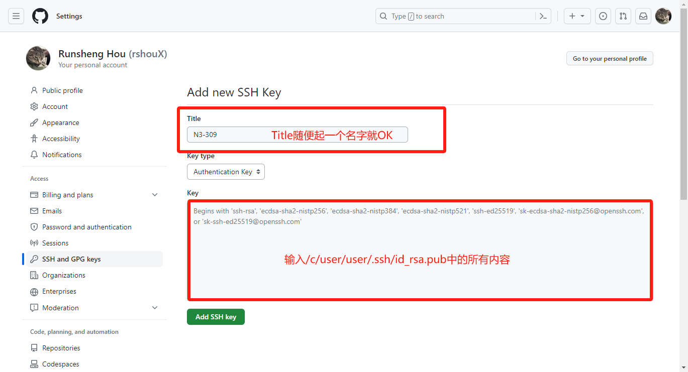
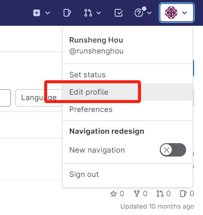
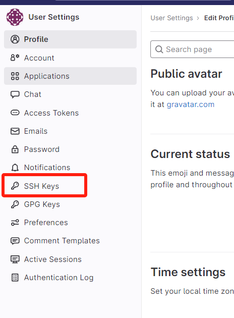
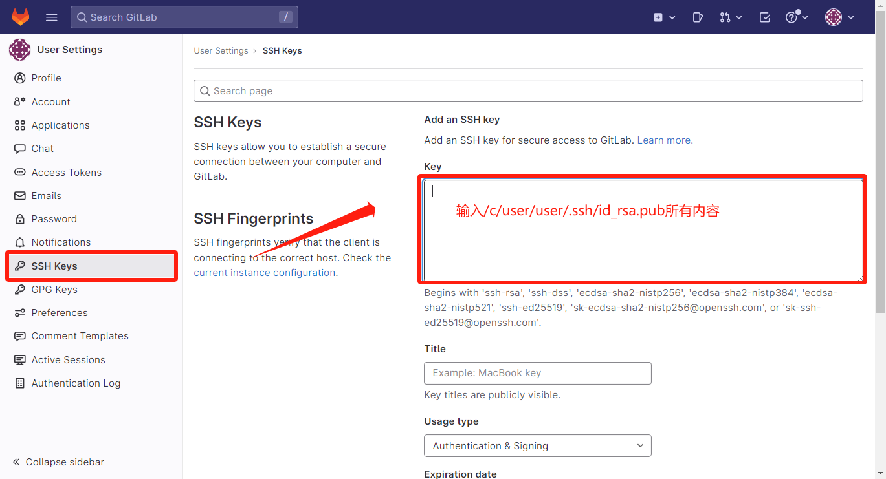

# Git 使用教程

# Table of Content
- [Git 使用教程](#git-使用教程)
- [Table of Content](#table-of-content)
- [0. Related Resources](#0-related-resources)
- [1. Git 下载安装](#1-git-下载安装)
- [2. Git 创建仓库](#2-git-创建仓库)
  - [2.1 git init（optional）](#21-git-initoptional)
    - [2.1.1 使用当前目录创建仓库](#211-使用当前目录创建仓库)
    - [2.1.2 使用指定目录创建仓库](#212-使用指定目录创建仓库)
    - [2.1.3 向仓库添加文件](#213-向仓库添加文件)
  - [2.2 git clone](#22-git-clone)
  - [2.3 git config](#23-git-config)
- [3. Git 基本操作](#3-git-基本操作)
  - [3.1 一般流程](#31-一般流程)
  - [3.2 git add](#32-git-add)
  - [3.3 git commit](#33-git-commit)
  - [3.4 git push](#34-git-push)
  - [3.5 git checkout](#35-git-checkout)
  - [3.6 git pull](#36-git-pull)
  - [3.7 optional commands](#37-optional-commands)
    - [3.7.1 git status](#371-git-status)
    - [3.7.2 git diff](#372-git-diff)
    - [3.7.3 git rm](#373-git-rm)
    - [3.7.4 git mv](#374-git-mv)
    - [3.7.5 恢复到刚clone 的状态](#375-恢复到刚clone-的状态)
- [4. Git 分支管理（optional）](#4-git-分支管理optional)
  - [4.1 Simple workflow](#41-simple-workflow)
  - [4.2 分支管理](#42-分支管理)
    - [4.2.1 列出分支](#421-列出分支)
    - [4.2.2 删除分支](#422-删除分支)
    - [4.2.3 分支合并](#423-分支合并)
    - [4.2.4 合并冲突](#424-合并冲突)
- [5. Git 提交历史（optional）](#5-git-提交历史optional)
  - [5.1 git log](#51-git-log)
  - [5.2 ****git blame****](#52-git-blame)
- [6. 远程仓库](#6-远程仓库)
  - [6.1 本地创建 ssh key](#61-本地创建-ssh-key)
  - [6.2 配置GitHub/GitLab](#62-配置githubgitlab)
    - [6.2.1 GitHub](#621-github)
    - [6.2.2 GitLab](#622-gitlab)


# 0. Related Resources

- [Quick Start of Git](https://www.runoob.com/w3cnote/git-five-minutes-tutorial.html)
- [GitHub 简明教程](https://www.runoob.com/w3cnote/git-guide.html)
- [Git tutorial](https://www.runoob.com/git/git-tutorial.html)
- [GitLab使用教程](https://www.cnblogs.com/vs1435/p/11775861.html)

本文主要根据 [Git tutorial](https://www.runoob.com/git/git-tutorial.html) 撰写，旨在帮助快速上手Git。

# 1. Git 下载安装

点击链接[[Git-2.42.0.2-64-bit](https://registry.npmmirror.com/-/binary/git-for-windows/v2.42.0.windows.2/Git-2.42.0.2-64-bit.exe)]即可开始下载，然后直接安装即可。

# 2. Git 创建仓库

<aside>
⭐ 2.1部分可跳过，可以直接去看2.2部分

</aside>

## 2.1 git init（optional）

### 2.1.1 使用当前目录创建仓库

```bash
# 先把路径转到你想创建repo的目录
cd /path/to/your/repo
git init
```

### 2.1.2 使用指定目录创建仓库

```bash
git init /path/to/your/repo
```

### 2.1.3 向仓库添加文件

如果**当前目录下**有几个文件想要纳入版本控制，需要先用 git add 命令告诉 Git 开始对这些文件进行跟踪，然后提交：

```bash
git add *.c
git add README
git commit -m 'init repo'

# 以上命令将目录下以 .c 结尾及 README 文件提交到仓库中。
# 也可以将命令简化为
git commit -a -m 'init repo'
```

## 2.2 git clone

使用 **git clone** 从现有 Git 仓库中拷贝项目，克隆仓库的命令格式为：

```bash
git clone <repo>

# 克隆repo到指定的目录
git clone <repo> <directory>

# eg.1 git clone http://101.42.253.43:14841/library/C0S00_Library
# eg.2 git clone http://101.42.253.43:14841/library/C0S00_Library /d/project/C0S00_Library
```

## 2.3 git config

```bash
# 显示当前git配置信息
git config --list

# 编辑git配置文件
git config -e
git config -e --global # 针对系统上所有仓库(全局)

# 设置提交代码时的用户信息
git config --global user.name "runshenghou"
git config --global user.email rshoux@gmail.com
```

# 3. Git 基本操作


- Git 的工作就是创建和保存你项目的快照及与之后的快照进行对比。
- Git 常用的是以下 6 个命令：**git clone、git add 、git commit、git push、git checkout、git pull**，[git clone](#22-git-clone) 已经在 [Git 创建仓库](#2-Git-创建仓库)中介绍过，因而不再赘述，其余命令后面会详细介绍。
- 3.1-3.6 部分需要看一下，3.7部分可跳过

## 3.1 一般流程

```bash
# clone 克隆仓库
cd /path/to/repo
git clone <repo>

# add 将修改过的文件提交到缓存区staging area
git add file_you_modified

# commit 将缓存区的内容提交到本地repo
git commit -m "message"

# push 上传远程代码并合并
git push
```

## 3.2 git add

- **用途：git add** 命令可将该文件的修改添加到暂存区（staging area）。
- 命令格式如下：

```bash
# 添加指定目录到暂存区
git add [dir]

# 添加一个或多个文件到暂存区
git add [file1] [file2] ...

# 添加当前目录下的所有文件到暂存区
git add .
```

## 3.3 git commit

- **用途：git commit** 命令将暂存区内容添加到本地仓库（local repo）中。
- 命令格式如下：

```bash
# 提交暂存区到本地仓库中,[message] 可以是一些备注信息。
git commit -m [message]

# 提交暂存区的指定文件到仓库区：
git commit [file1] [file2] ... -m [message]

# -a 参数设置修改文件后不需要执行 git add 命令，直接来提交
git commit -a -m [message]
```

## 3.4 git push

- **用途：git push** 命令用于从将本地的分支版本上传到远程并合并。
- 命令格式如下：

```bash
git push <远程主机名> <本地分支名>:<远程分支名>

# 若本地分支名与远程分支名相同，则远程分支名可省略
git push <远程主机名> <本地分支名>

# 强制推送使用 --force 参数
git push --force <远程主机名> <本地分支名>

# 删除主机分支使用 --delete 参数
git push <远程主机名> --delete <远程分支名>

```

在创建完GitHub Repo第一次提交时，应使用`-u`参数，`-u`: 也可以写作 `--set-upstream`，用于在推送代码的同时，将本地分支与远程分支进行关联，使得以后的推送和拉取操作更加方便。

```bash
# 由于现在GitHub新创建的repo分支名默认为main
# 为了统一分支命名，所以把分支重命名为main，更加规范
git branch -M main

# 首次提交使用，之后直接使用git push即可
git push -u origin main
```

**注意**：
只有在第一次commit后才会创建分支，才能使用`git branch -M`命令。

## 3.5 git checkout

- 用途：**git checkout** 命令用于在不同的分支之间切换、恢复文件、创建新分支等操作。
- 更多分支管理内容参考 [Git 分支管理](#4-git-分支管理optional) 部分。
- 命令格式如下：

```bash
# 以下命令允许你从当前分支切换到指定的分支 <branch-name>:
git checkout <branch-name>

# 以下命令用于创建一个新分支 <new-branch-name> 并立即切换到新创建的分支:
git checkout -b <new-branch-name>

# 以下命令可以将指定文件 <file> 恢复到最新的提交状态，丢弃所有未提交的更改，这对于撤销不需要的更改非常有用：
git checkout -- <file>

# 可以使用提交的哈希值 <commit-hash> 或 标签 <tag_name> 来切换到特定的提交状态。
git checkout <tag-name>

# 如果的工作区中的更改尚未添加（add）和提交（commit），将工作区恢复为本地仓库的状态：
git checkout .
```

## 3.6 git pull

- 用途：**git pull** 命令用于从远程获取代码并合并本地的版本，即**更新到最新版本**。
- 命令格式：

```bash
git pull
git pull <远程主机名> <远程分支名>:<本地分支名>
```

## 3.7 optional commands

### 3.7.1 git status

- **git status** 是一个用于查看 Git 仓库当前状态的命令。
- **git status** 命令可以查看在你上次提交之后是否有对文件进行再次修改。

```bash
git status
git status -s
# 通常使用 '-s' 参数来获得简短的输出结果
```

### 3.7.2 git diff

- git diff 命令比较文件的不同，即比较文件在暂存区和工作区的差异。
- git diff 命令显示已写入暂存区和已经被修改但尚未写入暂存区文件的区别。

```bash
# 显示暂存区 (staging area) 和工作区 (workplace) 的差异
git diff [file]

# 显示暂存区 (staging area) 和上一次commit (local repo) 的差异
git diff --cached [file]
```

### 3.7.3 git rm

- 类似于Linux命令`rm`

```bash
git rm <file>              # 将文件从暂存区和工作区中删除
git rm -f <file>           # 强行从暂存区和工作区中删除修改后的文件

# 如果想把文件从暂存区域移除，但仍然希望保留在当前工作目录中，换句话说，仅是从跟踪清单中删除，使用 --cached 选项即可：
git rm --cached <file>
```

### 3.7.4 git mv

- 移动或重命名工作区文件。

### 3.7.5 恢复到刚clone 的状态

```bash
git reset --hard HEAD
git clean -f –d
```

# 4. Git 分支管理（optional）

几乎每一种版本控制系统都以某种形式支持分支，一个分支代表一条独立的开发线。

使用分支意味着你可以从开发主线上分离开来，然后在不影响主线的同时继续工作。


## 4.1 Simple workflow

```bash
# 创建分支
git branch <branchname>

# 切换分支
git checkout <branchname>

# 创建并切换到新分支
git checkout -b <branchname>

# 合并分支
git merge [branchname]
```

## 4.2 分支管理

### 4.2.1 列出分支

列出分支基本命令：

```bash
git branch
```

没有参数时，**git branch** 会列出你在本地的分支。

当你执行 **git init** 的时候，默认情况下 Git 就会为你创建 **master** 分支。

使用分支将工作切分开来，从而让我们能够在不同开发环境中做事，并来回切换。

### 4.2.2 删除分支

```bash
git branch -d <branchname>
```

### 4.2.3 分支合并

```bash
git merge [branchname]
```

合并完后需要删除分支。

### 4.2.4 合并冲突

- 当Git无法自动合并分支时，就必须首先解决冲突。解决冲突后，再提交，合并完成。
- 解决冲突就是把Git合并失败的文件手动编辑为我们希望的内容，再提交。
- 用`git log --graph`命令可以看到分支合并图。

# 5. Git 提交历史（optional）

## 5.1 git log

在使用 Git 提交了若干更新之后，又或者克隆了某个项目，想回顾下提交历史，我们可以使用 **git log** 命令查看。

**git log** 命令用于查看 Git 仓库中提交历史记录。

**git log** 显示了从最新提交到最早提交的所有提交信息，包括提交的哈希值、作者、提交日期和提交消息等。

**git log** 命令的基本语法：

```bash
git log [选项] [分支名/提交哈希]
```

常用的选项包括：

- `p`：显示提交的补丁（具体更改内容）。
- `-oneline`：以简洁的一行格式显示提交信息。
- `-graph`：以图形化方式显示分支和合并历史。
- `-decorate`：显示分支和标签指向的提交。
- `-author=<作者>`：只显示特定作者的提交。
- `-since=<时间>`：只显示指定时间之后的提交。
- `-until=<时间>`：只显示指定时间之前的提交。
- `-grep=<模式>`：只显示包含指定模式的提交消息。
- `-no-merges`：不显示合并提交。
- `-stat`：显示简略统计信息，包括修改的文件和行数。
- `-abbrev-commit`：使用短提交哈希值。
- `-pretty=<格式>`：使用自定义的提交信息显示格式。

## 5.2 ****git blame****

**git blame** 命令用于逐行显示指定文件的每一行代码是由谁在什么时候引入或修改的。

git blame 可以追踪文件中每一行的变更历史，包括作者、提交哈希、提交日期和提交消息等信息。

如果要查看指定文件的修改记录可以使用 git blame 命令，格式如下：

```bash
git blame [选项] <文件路径>
```

常用的选项包括：

- `L <起始行号>,<结束行号>`：只显示指定行号范围内的代码注释。
- `C`：对于重命名或拷贝的代码行，也进行代码行溯源。
- `M`：对于移动的代码行，也进行代码行溯源。
- `C -C` 或 `M -M`：对于较多改动的代码行，进行更进一步的溯源。
- `-show-stats`：显示包含每个作者的行数统计信息。

# 6. 远程仓库

## 6.1 本地创建 ssh key

- 设置全局变量

```bash
git config --global user.name "runshenghou"
git config --global user.email rshoux@gmail.com
```

- 生成ssh key 命令

```bash
ssh-keygen -t rsa -C "rshoux@gmail.com"
```

后面的邮箱改为你在github上注册的邮箱，之后会要求确认路径和输入密码，我们这使用默认的一路回车就行。成功的话会在`~/`下生成`.ssh`文件夹，进去，打开`id_rsa.pub`，复制里面的`key`。

## 6.2 配置GitHub/GitLab

### 6.2.1 GitHub

登录GitHub后依次点击：头像-Settings




为了验证是否成功，在git bash下输入：

```bash
ssh -T git@github.com
```

如果是第一次的会提示是否continue，输入yes就会看到：You've successfully authenticated, but GitHub does not provide shell access 。这就表示已成功连上GitHub。

<aside>
🌟 如何将本地仓库提交到远程仓库

- 若本地的repo是从GitHub直接clone下来的，则修改完本地repo后直接使用`git push`即可将更改提交到远程GitHub仓库。
- 若从GitHub新建一个远程仓库使用本地管理，则需要先配置远程repo，之后再进行git push。
    
    ```bash
    git remote add origin git@github.com:yourName/yourRepo.git
    ```
    
    `yourName`和`yourRepo`表示你在GitHub的用户名和仓库，加完之后进入.git，打开config，这里会多出一个remote "origin"内容，这就是刚才添加的远程地址，也可以直接修改config来配置远程地址。
    

如果在使用命令`git remote add`时报错：`fatal: remote origin already exists.`

- 这说明本地库已经关联了一个名叫`origin`的远程库，此时，可以先用`git remote -v`查看远程库信息，之后
    
    ```bash
    # 我们可以删除已有的GitHub远程库：
    git remote rm origin
    # 再关联远程库
    git remote add origin git@gitee.com:yourName/yourRepo.git
    ```
    

使用多个远程库时，我们要注意，git给远程库起的默认名称是`origin`，如果有多个远程库，我们需要用不同的名称来标识不同的远程库。

```bash
git remote add github git@github.com:yourName/yourRepo.git
git remote add gitee  git@gitee.com:yourName/yourRepo.git

# 此时push命令需要发生改变
git push github master
git push gitee  master

git push <remote_repo_name> <branch_name>
```

</aside>

### 6.2.2 GitLab

登录GitLab，如下图操作。





